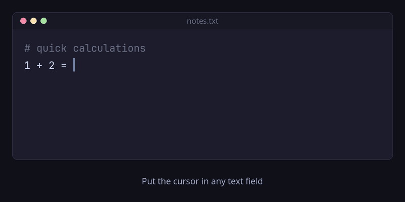

# fcitx5-sexp-calc

[English](README.md) | 日本語

fcitx5 の QuickPhrase 上で S式を評価する電卓。`(+ 1 2)` と打つと `3` が入力される。



- IME 非依存: Mozc が有効でも英語キーボードでも同じように動く
- fcitx5-lua の QuickPhrase ハンドラとして実装 (本体は `sexp_calc.lua` 1 ファイル)

## 必要なもの

- fcitx5 5.1 系
- [fcitx5-lua](https://github.com/fcitx/fcitx5-lua) (Arch/CachyOS: `sudo pacman -S fcitx5-lua`)
- テスト用 (任意): Lua 5.5 (`lua5.5`)、python-gobject

## インストール

```sh
make install   # ~/.local/share/fcitx5/lua/imeapi/extensions/sexp_calc.lua -> リポジトリへのリンク
make restart   # fcitx5 を再起動して反映
```

`make restart` は `systemctl --user restart app-org.fcitx.Fcitx5@autostart.service` を実行する。
再起動後は IM の状態が英語キーボードに戻るので、Ctrl+Space などで Mozc に戻す。
`fcitx5-remote -r` では新しく入れたアドオンが認識されなかった。

## 使い方

1. QuickPhrase を起動する。既定キーは `Super+`` または `Super+;`
2. `(+ 1 2)` のように S式を入力する
3. 閉じ括弧が揃った時点で評価され、結果 `3` が確定入力される

- 式に誤りがあると候補欄に「Error: undefined function: foo」のように理由が出る。Backspace で直すか Esc で取り消す
- 括弧が閉じきるまでは候補を出さない。候補があると Space が候補選択になり、式の中のスペースが打てなくなるため

## 設定

`sexp_calc.lua` 先頭の `AUTO_COMMIT` を `false` にすると即時確定せず、結果を候補として表示する。
Space か `1` キーで確定。変更後は `make restart`。

## 対応している式

| 種類 | 関数 |
| --- | --- |
| 四則演算 | `+` `-` `*` `/` (可変長引数) |
| 整数演算 | `mod` (`modulo` `%`) `remainder` (`rem`) `quotient` (`div`) `gcd` `lcm` |
| べき乗・平方根 | `expt` (`pow` `^` `**`) `sqrt` `square` |
| 丸め | `floor` `ceiling` (`ceil`) `round` `truncate` `abs` |
| 指数・対数・三角 | `exp` `log` (1 or 2 引数) `sin` `cos` `tan` `asin` `acos` `atan` (1 or 2 引数) |
| その他 | `min` `max` `1+` `1-` |
| 比較・論理 | `=` `<` `>` `<=` `>=` `not`、特殊形式 `if` `and` `or` `let` (`let*`) |
| 定数 | `pi` `e` `#t` `#f` |

数値リテラルは Lua の `tonumber` に従う (`10` `-3` `1.5` `1e3` `0x10`)。
整数同士は整数で計算し、割り切れないときや 2^62 を超えるときだけ浮動小数になる。
`(/ 6 3)` → `2`、`(/ 7 2)` → `3.5`、`(* 123456789 987654321)` → `121932631112635269`。

## 仕組み

fcitx5-lua の imeapi アドオンは `lua/imeapi/extensions/*.lua` を起動時に読み込む。
本拡張は `fcitx.addQuickPhraseHandler` でハンドラを登録し、QuickPhrase の入力文字列を受け取って
`{確定文字列, 表示文字列, アクション}` の配列を返す。

- `(` で始まる入力だけを扱い、`Break` (-1) で内蔵辞書・スペルチェックの候補を抑止する
- 括弧の深さが 0 になったら評価し、`AutoCommit` (6) で即時確定する
- 評価に失敗したら `DoNothing` (5) の候補でエラー理由を表示し、`NoneSelection` (4) で数字キーの候補選択を無効にする

## 開発

デモ GIF は `python3 docs/make_demo.py` で再生成できる (Pillow が必要)。
画面録画ではなく Pillow で描画したアニメーションで、表示する結果は `sexp_calc.lua` を実際に呼んで計算している。

```sh
make test   # Lua 単体テスト (LUA=lua5.4 make test で処理系を変更可)
make e2e    # DBus 経由の実機テスト。fcitx5 起動中に実行する
```

`test/e2e_fcitx.py` は fcitx5 の DBus フロントエンドで入力コンテキストを作り、
キーイベントを送って `CommitString` を観測する。GUI もフォーカスも不要。
IC 作成時に `display` を渡して専用フォーカスグループにしないと、実アプリの IC にフォーカスを奪われる。

## ライセンス

MIT。詳細は [LICENSE](LICENSE) を参照。
